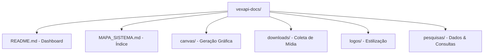

# MAPA_SISTEMA: VexAPI Documentation 🌀🗺️

Este documento é o **Índice Central** de todo o ecossistema de documentação da VexAPI. Ele organiza e conecta todas as rotas, ferramentas e exemplos práticos disponíveis no repositório.

## 🗂️ Categorias de Documentação

### 🎨 [Módulo Canvas (Geração de Imagens)](./canvas/README.md)
Documentação focada em ferramentas de edição gráfica dinâmica.
- **Cartões**: Boas-vindas, despedida e perfis sociais.
- **Efeitos**: Estilo Discord, Brat (Charli XCX), GIFs de amor e amizade.
- **Utilidades**: Ping e status visual.

### 📥 [Módulo Downloads (Integrações Social Media)](./downloads/README.md)
Guia de consumo dos endpoints para coleta de mídia.
- **Vídeo/Áudio**: TikTok, Kwai, Facebook e YouTube (MP3/MP4).
- **Música**: Spotify e SoundCloud.
- **Social**: Pinterest e Instagram.

### 🖼️ [Módulo Logos & Identidade](./logos/README.md)
Criação e manipulação de logotipos e ativos visuais.
- **EmojiMix**: Combinação de emojis.
- **Unico Logo**: Estilos temáticos singulares.

### 🎭 [Módulo DualLogos (Logos de 2 Textos)](./duallogos/README.md)
Geração de marcas complexas com títulos e slogans.
- **Temas**: Deadpool e outros designs compostos.

### 📰 [Módulo News (Atualizações em Tempo Real)](./news/README.md)
Coleta de manchetes dos principais portais brasileiros.
- **Portais**: G1, Estadão, UOL, Poder360 e Jovem Pan.

### 🎮 [Módulo Quiz & Entretenimento](./quiz/README.md)
Ferramentas para jogos interativos e desafios.
- **Trivias**: Perguntas de múltipla escolha por categoria.

### 🎨 [Módulo Edits (Filtros & Pop Culture)](./edits/README.md)
Edição rápida de imagens e aplicação de filtros artísticos.
- **Filtros**: P&B, Cinema, Desfoque e memes reativos (Wojak).

### 🔍 [Módulo Pesquisas & Tools](./pesquisas/README.md)
Consultas de dados e ferramentas utilitárias.
- **Buscas**: Pinterest imagens, letras de música e APKs.
- **Tratamento**: Edição e conversão de textos/objetos.

---

## 🛠️ Arquitetura do Repositório

## 📜 Regras de Governança
- **Manutenção**: Scripts `.js` devem ser sempre acompanhados de uma descrição no `README.md` da respectiva pasta.
- **Padronização**: Todo parâmetro obrigatório deve ser demarcado com `(Required)`.
- **Exemplos**: Utilize sempre URLs reais e funcionais para testes imediatos.
